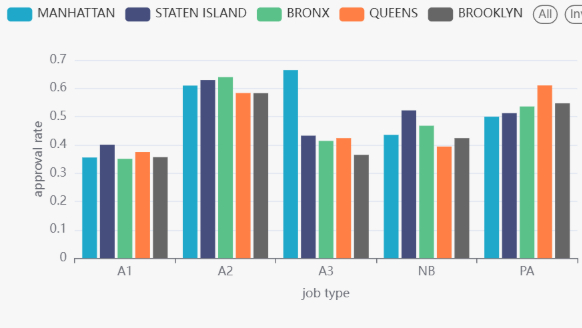

# Predicting NYC Building Permit Approval

## Title

**Project:** End-to-end distributed big data pipeline for the DOB Job Application Filings dataset  
**Team:** Team 13  
**Team Members:** Polina Korobeinikova, Vladislav Kolinichenko, Janna Ivanova, Kira Maslennikova  
**Goal:** Predict whether a New York City building permit application will be approved or disapproved after plan examination  
**Dataset:** NYC Department of Buildings Job Application Filings  
**Pipeline:** PostgreSQL + Sqoop + HDFS + Hive + Spark + Apache Superset  

---

## Introduction

New York City gets thousands of building permit applications every year. For developers, contractors, and city planners, these applications are very important. If we can predict early whether a permit will be approved or not, it can save time and help people make better decisions.
In this project we built a big data pipeline using the DOB Job Application Filings dataset. The data goes through several steps: first it starts as a raw CSV file, then we load it into PostgreSQL, export it to HDFS, set up Hive tables, do data analysis, and finally train Spark ML models. The results are shown in an Apache Superset dashboard.

The main goal is binary classification. We look at the final plan examination decision and predict if an application will be approved or disapproved.

### Business Objectives

The main goal is to understand permit applications better and predict the final decision earlier.

This can help in several ways:

1. Contractors can estimate the chance of approval before spending too much time and money.
2. Developers can plan their projects with less uncertainty.
3. Urban planners can better study the approval patterns across boroughs and building types.
4. The Department of Buildings can see which types of applications are more likely to be approved or rejected.

## Data Description

We used the NYC Department of Buildings Job Application Filings dataset. It contains permit applications from the five NYC boroughs. The dataset has many kinds of features, such as:

- application and job fields,
- borough and address fields,
- job type and job status fields,
- applicant and owner information,
- cost and size fields,
- date fields,
- geographic fields like latitude and longitude.

The dataset is not fully clean in the raw form, so we first kept the raw data as text in PostgreSQL and then created a typed fact table for analysis.

One important point is the target variable. The dataset has `job_status` and `job_status_descr`. The `job_status_descr` column is a description of the status, while `job_status` is the short status code. For the prediction task, we used only the final decision records. After that, we labeled the target as:

- `P` for approved,
- `J` for disapproved.

Because of this labeling, the machine learning task became binary classification.

### Data Characteristics

The dataset is large enough for big data processing.

- records in PostgreSQL: `2,714,628`
- distinct job numbers: `1,622,657`
- boroughs: `5`
- size of the exported Avro file in HDFS: about `815 MB`
- columns in the raw table: `98`
- columns in the fact table: `98`
- records used for binary EDA and ML before dropping missing values: `251,999`
- approved records in the binary subset: `129,558`
- disapproved records in the binary subset: `122,441`

The dataset contains several important feature groups:

- location fields: `borough`, `house_number`, `street_name`, `block`, `lot`, `bin_number`
- application fields: `job_number`, `doc_number`, `job_type`, `job_status`, `job_status_descr`
- applicant fields: `applicant_first_name`, `applicant_last_name`, `applicant_professional_title`, `applicant_license`, `professional_cert`
- owner fields: `owner_type`, `owner_business_name`, `owner_first_name`, `owner_last_name`
- size and cost fields: `initial_cost`, `total_est_fee`, `existing_zoning_sqft`, `proposed_zoning_sqft`, `enlargement_sqft`, `street_frontage`, `proposed_no_of_stories`, `proposed_height`, `total_construction_floor_area`
- date fields: `pre_filing_date`, `latest_action_date`, `signoff_date`, `special_action_date`
- geospatial fields: `gis_latitude`, `gis_longitude`, `gis_council_district`, `gis_census_tract`, `gis_nta_name`

The class balance is almost even in the final binary subset. About `51.4%` of the selected records are approved and about `48.6%` are disapproved. This is good for binary classification because the model does not learn only one dominant class.

For the ML part, before automatic feature selection, we exclude only the target itself and process-leakage fields that describe the decision process after the filing is already moving through DOB review.

The target fields are excluded because they directly contain the answer:

- `job_status` is the binary label used for prediction.
- `job_status_descr` is the text description of the same status.

The leakage fields are excluded because they describe downstream workflow state, payments, assignment, approval, signoff, withdrawal, or later DOB action dates:

- `latest_action_date` records the latest status/action date and can summarize process progress.
- `paid` records payment timing after the filing enters the process.
- `fully_paid` records completed payment timing.
- `assigned` records assignment to review workflow.
- `approved` records the approval date, which directly leaks the positive outcome.
- `fully_permitted` records a later permitting milestone after approval workflow.
- `signoff_date` records signoff after review/permitting progress.
- `special_action_status` records a special administrative action state.
- `special_action_date` records the date of that special administrative action.
- `withdrawal_flag` records whether the filing was withdrawn during the process.
- `fee_status` records fee/payment state after filing.
- `job_no_good_count` records DOB process/problem status rather than a stable pre-review application attribute.
- `dobrundate` records dataset processing/update timing rather than an application attribute.

All other columns remain eligible candidates for the ML model.

---

## Architecture of data pipeline

### The input and the output for each stage

The project has four stages. Each stage takes the output of the previous stage and creates a new output for the next one.

#### Stage I

Input:

- raw CSV file from Yandex Disk

Main processing:

- download the dataset
- load it into PostgreSQL
- convert the raw table into a typed fact table
- export the fact table to HDFS with Sqoop

Outputs:

- `data/dob_job_application_filings.csv`
- PostgreSQL staging table `raw_dob_job_applications` (dropped after Stage I validation)
- PostgreSQL table `fact_job_applications`
- HDFS Avro files in `/user/team13/project/warehouse/fact_job_applications`

The raw table is a staging object. It is used only for loading and validation, and it is dropped after Stage I. The final persistent relational table is `fact_job_applications`.

#### Stage II

Input:

- Avro data in HDFS from Stage I

Main processing:

- create Hive external tables
- optimize storage with partitioning and bucketing
- run EDA queries on the Hive data

Outputs:

- temporary Hive external table `fact_job_applications_ext` (dropped after Stage II optimization)
- optimized external ORC Hive table `fact_job_applications_opt`
- EDA CSV files `output/q1.csv` ... `output/q8.csv`
- EDA chart images `output/q1.jpg` ... `output/q7.jpg`
- Hive logs in `output/hive_results.txt`, `output/hive_optimization_results.txt`, and `output/hive_cleanup_results.txt`

The external Avro table is used only to register the Sqoop output in Hive. It is dropped after the optimized ORC table is created. The optimized ORC table is kept for EDA, ML, and dashboard preparation.

#### Stage III

Input:

- optimized Hive table from Stage II

Main processing:

- select useful features
- prepare the target variable
- build the Spark ML pipeline
- train and tune the models on YARN
- save train/test splits and prediction files

Outputs:

- train/test JSON files in `data/`
- trained Spark models in `models/model1/` and `models/model2/`
- prediction files in `output/model1_predictions.csv` and `output/model2_predictions.csv`, with `75,562` data rows plus a header in each prediction/test file
- model comparison file in `output/evaluation.csv`

#### Stage IV

Input:

- Hive outputs from Stage II
- model outputs from Stage III

Main processing:

- create Hive views and external tables for Superset
- prepare dashboard-ready datasets

Outputs:

- dashboard Hive tables and views
- dashboard dataset tables such as `dashboard_q8`, `dashboard_feature_selection`, `dashboard_model1_predictions`, `dashboard_model2_predictions`, `dashboard_evaluation`, `dashboard_hyperparameter_results`
- dashboard preparation log in `output/dashboard_results.txt`

## Data preparation

### ER diagram

The database design uses two tables during ingestion: `raw_dob_job_applications` and `fact_job_applications`.

The pipeline uses `raw_dob_job_applications` as a raw staging table during ingestion, but the final persistent relational table is `fact_job_applications`. The raw table stores the source CSV values as text and allows the PostgreSQL `COPY` step to be robust to malformed or missing values. After the transformation and validation queries are completed, the staging table can be dropped to avoid keeping duplicate persistent storage.

The relation is simple:

`raw_dob_job_applications` -> `fact_job_applications`

Therefore, the final database state contains the typed analytical table, while the ingestion process still remains reproducible and fault-tolerant.

The source dataset is a large operational open-data CSV with many nullable fields. Therefore, we avoid aggressive `NOT NULL` constraints that could reject valid but incomplete public records. We keep primary keys and domain checks where they are safe, while the transformation SQL handles invalid numeric and geospatial values by converting them to `NULL`.

### Some samples from the database

The fact table contains permit records with borough, job type, status, dates, costs, and geographic fields. The sample query in the Hive log shows records such as:

- a Brooklyn `A1` job with status `X`, description `SIGNED OFF`, and coordinates near Park Slope-Gowanus;
- a Brooklyn `A3` job with status `J`, description `PLAN EXAM - DISAPPROVED`, and coordinates near Bensonhurst West;
- a Brooklyn `NB` job with status `P`, description `PLAN EXAM - APPROVED`, and coordinates near East New York.

These samples show that the table stores both business information and technical fields. It has the permit type, status, dates, owner/applicant fields, size fields, and geospatial fields in one typed fact table.

### Preparing the data for analysis

The PostgreSQL schema is created in `sql/create_tables.sql`. The raw table stores the source data as text, and the fact table stores the typed version of the same data. The raw table keeps almost all columns as `TEXT`, while the fact table converts important fields such as identifiers, numeric values, costs, counts, and geographic coordinates into SQL types that are easier to analyze.

The loading step is implemented in `scripts/build_projectdb.py`. Python is only the orchestrator. It does not insert records row by row and does not collect the CSV into a Python list or pandas DataFrame. The CSV is streamed into PostgreSQL using `psycopg2.copy_expert`, which executes PostgreSQL `COPY FROM STDIN`. This is a bulk-loading mechanism.

The final step of Stage I is `scripts/sqoop_to_hdfs.sh`. It removes the previous HDFS target directory, exports `fact_job_applications` to HDFS, stores the data in Avro format, and uses Snappy compression. Avro was selected because it is self-describing through `.avsc` schemas and supports parallel processing in Hadoop because Avro files are splittable. Snappy adds fast compression and decompression with reasonable storage savings, so the combination reduces storage cost while keeping read performance suitable for Hive and Spark analytics.

The Sqoop import is not executed as a local Python loop. It is submitted as a YARN MapReduce job. We use four mappers and split the PostgreSQL table by `fact_id`, so the import is parallelized into four input splits. The HDFS output contains four `part-m` files, which correspond to the mapper outputs.

The stage is repeatable. The SQL scripts drop old objects before creating new ones, and the Sqoop script deletes the old HDFS target before a new import. Because of this, Stage I can be run again without leftover objects causing errors.

The validation checks confirm that the data was loaded correctly. The final results of Stage I are:

- raw row count: `2714628`
- fact row count: `2714628`
- distinct job numbers: `1622657`
- rows with missing `latest_action_date`: `0`
- rows with missing latitude/longitude: `8850`

The raw and fact tables both contain `2,714,628` rows. This confirms that the transformation from the raw staging table to the typed fact table did not drop records. The borough distribution contains the five expected NYC boroughs, which validates the domain of the location field. The top `job_status` values show that the categorical status field was loaded and preserved.

The main outputs of Stage I are:

- `data/dob_job_application_filings.csv`
- PostgreSQL fact table `fact_job_applications`
- HDFS Avro export under `/user/team13/project/warehouse/fact_job_applications`
- generated Avro schema files in HDFS under `/user/team13/project/warehouse/avsc`
- Sqoop-generated local schema artifacts in `output/`

After Stage I, the cleaned fact table is exported to HDFS in Avro format. This makes it possible to create Hive tables in the next stage and use the data for analysis.

After importing the PostgreSQL fact table into HDFS in Stage I, we registered the Sqoop output in Hive as an external Avro table. The table `fact_job_applications_ext` points to the HDFS location with the Avro files and uses the generated Avro schema from Stage I. This design avoids copying the original Sqoop output and keeps Hive as a metadata layer over the existing HDFS data.

Hive needs the Avro schema to interpret the binary `.avro` files produced by Sqoop. The external Hive table references the schema through `avro.schema.url`, so Hive can map Avro fields to Hive columns.

For analytical processing, we then created an optimized Hive table `fact_job_applications_opt`. This table was created as an external table stored in ORC format with Snappy compression. ORC was selected for the optimized analytical layer because it is a column-oriented format and is more suitable for repeated Hive queries than the original row-oriented Avro ingestion format. The table contains `2,714,628` rows, matching the number of records imported in Stage I. This confirms that the transformation from the external Avro table to the optimized ORC table did not drop records.

The optimized table was partitioned by `job_status`. This choice follows the workload of our EDA queries: most approval-rate queries compare approved and rejected applications and repeatedly filter the data using `job_status IN ('P', 'J')`. By using `job_status` as the partition key, Hive can prune irrelevant status partitions and scan only the partitions needed for approval/rejection analysis.

Inside each `job_status` partition, the table was bucketed by `borough` and `job_type` into `8` buckets. These two fields are central analytical dimensions in our project. `borough` represents the geographical dimension of the permit application, while `job_type` describes the type of building permit work. Several EDA queries group approval rates by borough and job type, so bucketing by these fields provides additional physical organization without creating too many small partition directories.

After the optimized table was created and validated, the initial unpartitioned external table `fact_job_applications_ext` was dropped from the Hive metastore. Since it was an external table, dropping it removed only Hive metadata and did not delete the original Avro files in HDFS. The remaining table used for EDA was `fact_job_applications_opt`, satisfying the requirement to perform analysis on the optimized partitioned and bucketed Hive table.

---

## Data analysis

### Analysis results

We used HiveQL to analyze the prepared data in Hive. The main EDA outputs are saved in `output/q1.csv` to `output/q8.csv`. Queries `q1` to `q7` are business insights. Query `q8` checks feature coverage for ML.

The EDA was done only on records with final plan examination decisions:

- `P` means approved;
- `J` means disapproved.

This gives `251,999` records for the approval analysis. The overall approval rate in this subset is about `51.4%`.

### Chart 1. Approval rate by borough and job type

This chart compares approval rates across borough and job type combinations. It shows that approval is not the same in all parts of the city. For large groups, Manhattan `A3` has an approval rate of about `66.4%`, Bronx `A2` has about `64.0%`, and Staten Island `A2` has about `62.9%`. At the same time, large `A1` groups are much lower: Bronx `A1` is about `35.1%`, Manhattan `A1` is about `35.6%`, and Brooklyn `A1` is about `35.7%`.

Interpretation: location and job type both affect the final decision. The same city process gives different results for different borough and job type pairs. For business users, this means that risk should be estimated by both location and work type, not by one common city average.

### Chart 2. Approval rate by borough and job type for the main boroughs

This chart focuses on Brooklyn and Manhattan. These boroughs have many records, so they are useful for comparison. Manhattan `A2` has `57,057` records and an approval rate of about `61.0%`. Brooklyn `A2` has `30,695` records and an approval rate of about `58.3%`. But for `A1`, both boroughs are much lower: Manhattan is about `35.6%` and Brooklyn is about `35.7%`.

Interpretation: the job type effect stays strong even when we compare only two large boroughs. `A2` applications look more likely to be approved than `A1` applications in both boroughs. This is a useful signal for planning and also a useful feature for ML.

### Chart 3. Approval rate by feature type

This chart shows approval rates for selected work-scope flags. The values are very different. `fuel_burning` has about `75.0%` approval, `fuel_storage` has about `67.2%`, and `sprinkler` has about `64.0%`. But `fire_alarm` is only about `2.2%`, and `fire_suppression` is about `33.2%`.

Interpretation: system-related work is not one simple group. Some technical work types are approved often, while some safety-related categories have much lower approval. This can help applicants understand where review risk is higher and where documents may need more careful checking before submission.

### Chart 4. Approval rate by professional certification and owner type

This chart combines professional certification and owner type. The difference is strong. For individual owners without professional certification, the approval rate is about `33.6%`. For corporations without certification, it is about `37.2%`. With professional certification, the rates are much higher: certified individual owners have about `83.7%`, certified corporations have about `87.1%`, and certified partnerships have about `88.7%`.

Interpretation: professional certification is one of the strongest EDA signals. It probably means that certified submissions are more complete or better prepared. For stakeholders, this is a practical finding: involving a certified professional can reduce approval risk.

### Chart 5. Approval rate by construction area bucket

This chart groups projects by total construction floor area. The `0` bucket is very large with `211,214` records and about `53.9%` approval. For non-zero projects, the approval rate goes down as the area becomes larger. Projects below `1k` square feet have about `43.2%` approval. Projects from `20k` to `100k` have about `35.1%`, and projects above `100k` have about `30.6%`.

Interpretation: larger projects are usually harder to approve. This makes sense because large projects can have more complex code, zoning, and safety requirements. The big zero bucket also shows a data quality issue: zero can mean a real value, but it can also mean missing or not applicable information.

### Chart 6. Approval rate by proposed number of stories

This chart shows how the proposed number of stories relates to approval. Low-rise projects have many records and medium approval rates. For example, 2-story projects have `46,662` records and about `48.2%` approval. 3-story projects have `31,377` records and about `47.0%`. Some taller groups have higher approval rates: 20-story projects have about `71.2%`, 19-story projects have about `70.0%`, and 18-story projects have about `68.2%`.

Interpretation: height matters, but the pattern is not simple. Higher stories do not always mean lower approval. One possible reason is that taller projects may be prepared by larger professional teams and may have more complete documentation. Because of this, proposed stories should be used together with owner type, professional certification, location, and project type.

### Chart 7. Approval rate by neighborhood

This chart shows approval rate by NTA neighborhood. The difference between neighborhoods is clear. Among neighborhoods with at least 1,000 records, Turtle Bay-East Midtown has about `65.4%` approval, Yorkville has about `65.3%`, and Gramercy has about `64.3%`. Lower values appear in Hammels-Arverne-Edgemere with about `36.9%`, Greenpoint with about `39.5%`, and East New York with about `39.8%`.

Interpretation: approval patterns are not the same across the city. This can be connected with building stock, project type, zoning context, and local development patterns. For urban planners, this chart gives a useful spatial view of where approval risk is higher or lower.

### Chart 8. Feature coverage before ML

This chart shows how many non-null values selected candidate features have in the binary `P/J` subset. Some fields have full coverage, for example `borough`, `job_type`, `existing_zoning_sqft`, `proposed_zoning_sqft`, `enlargement_sqft`, `street_frontage`, `proposed_no_of_stories`, `proposed_height`, `total_construction_floor_area`, and `pre_filing_date`. Geospatial fields are also almost complete: `gis_latitude` and `gis_longitude` have `250,447` non-null rows out of `251,999`.

Some fields are too sparse or not useful for ML. For example, `boiler` has only `5,430` non-null rows, `fire_suppression` has `2,985`, and `fire_alarm` has `11,183`. `initial_cost` and `total_est_fee` have `0` useful non-null rows in the final binary subset.

Interpretation: this chart connects EDA with ML. It explains why some features were removed before modeling. We did not remove them randomly; we removed them because they did not have enough usable information.

---

## ML modeling

### Feature extraction and data preprocessing

For ML, we used the optimized Hive table `fact_job_applications_opt`. First, we kept only rows where `job_status` is `P` or `J`, because these values are the final decision classes. This gave `251,999` records in the filtered binary dataset used for modeling.

The remaining candidate columns are converted by type: categorical fields are indexed and one-hot encoded, numerical fields are assembled directly, the filing date is decomposed into cyclical date features, and latitude/longitude are converted into geospatial coordinates.

Categorical columns were encoded with `StringIndexer` and `OneHotEncoder`. Numeric columns were kept as numeric values. The date feature was transformed into year, month, and day parts, and the month and day were also encoded with sine and cosine values. Geographic coordinates were converted into ECEF-style features `gis_x`, `gis_y`, and `gis_z`.

After feature engineering, we assembled everything into one feature vector. We also used `VectorIndexer` before training. Then the target was labeled as:

- `1.0` for approved applications (`P`)
- `0.0` for disapproved applications (`J`)

The modeling dataset had `251,999` records after filtering to the binary `P/J` task. The dataset was split with about `70%` for training and `30%` for testing.

We then compare several automatic feature-selection variants:

- all eligible structured features;
- the same feature set after `VarianceThresholdSelector` with threshold `0.05`;
- features with at least 50% non-null coverage, followed by `VarianceThresholdSelector`;
- the coverage and variance-selected feature set followed by chi-square supervised selection.

### Training and fine-tuning

We trained two classification models on YARN:

1. Logistic Regression
2. Random Forest Classifier

For each model, we used grid search with 3 values for each of 2 hyperparameters, so each grid had 9 combinations. We also used 3-fold cross validation to choose the best parameter set.

For Logistic Regression, the tuned parameters were:

- `regParam`: `0.0`, `0.01`, `0.1`
- `elasticNetParam`: `0.0`, `0.5`, `1.0`

For Random Forest, the tuned parameters were:

- `numTrees`: `10`, `20`, `30`
- `maxDepth`: `5`, `10`, `15`

The trained models were saved to HDFS and copied back to the local `models/` folder.

The best Logistic Regression setting was:

- `regParam = 0.0`
- `elasticNetParam = 1.0`
- full dataset
- cross-validation Area Under ROC: `0.8190215279000557`

The best Random Forest setting was:

- `numTrees = 30`
- `maxDepth = 15`
- variance-selected dataset
- cross-validation Area Under ROC: `0.8633244334042158`

### Evaluation

Because this is a binary classification task, we evaluated the models with:

- Area Under ROC
- Area Under PR

The final model comparison was saved in `output/evaluation.csv`, and the prediction files were saved in:

- `output/model1_predictions.csv`
- `output/model2_predictions.csv`

The final test results are:

| Model | Area Under ROC | Area Under PR |
|---|---:|---:|
| Logistic Regression | `0.8228627870758135` | `0.8329192482076343` |
| Random Forest Classifier | `0.8700345946791629` | `0.8847341081046691` |

Random Forest performed better on both required metrics.  This means the non-linear model captured the patterns in the permit data better than the linear model.

---

## Data presentation

### The description of the dashboard

The dashboard was prepared in Apache Superset. Stage IV creates Hive datasets and views that Superset can use for charts. The dashboard is the final presentation layer of the project. It does not replace EDA or ML; it shows their results in one place for business users.

The dashboard contains three main groups of information:

- data characteristics and feature coverage;
- EDA insights about approval patterns;
- ML results, including model evaluation, feature selection, hyperparameter results, and prediction outputs.

The dashboard is based on Hive objects created in `sql/dashboard.hql`. The main dashboard-ready objects are:

- `dashboard_data_characteristics`
- `dashboard_q8`
- `dashboard_feature_selection`
- `dashboard_model1_predictions`
- `dashboard_model2_predictions`
- `dashboard_evaluation`
- `dashboard_hyperparameter_results`

The dashboard preparation log is saved in `output/dashboard_results.txt`.

TODO: add the final Superset dashboard link or screenshot and the exact final dashboard title after the team confirms it.

### Description of each chart

The dashboard should include the following chart groups. The exact chart names should be checked against the final Superset dashboard before submission.

Chart group 1: data characteristics. This part shows the size of the prepared dataset and the number of records used in binary classification. It helps the viewer understand the scale of the project before looking at insights.

Chart group 2: feature coverage. This chart uses `q8` and `dashboard_feature_selection`. It shows which fields have enough data for modeling and which fields were removed. This is important because feature selection was based on real data quality, not only on intuition.

Chart group 3: approval by borough and job type. This chart shows that approval rate changes by both location and type of work. It supports the business idea that risk should be estimated for a specific application profile.

Chart group 4: approval by professional certification and owner type. This chart shows that professional certification is strongly connected with approval rate. Certified submissions have much higher approval rates in the main owner groups.

Chart group 5: approval by construction area and proposed stories. These charts show that project scale is related to the approval decision. Large construction area has lower approval rates, while proposed stories have a more complex pattern.

Chart group 6: approval by neighborhood. This chart gives a spatial story. It shows that some neighborhoods have much higher approval rates than others.

Chart group 7: model performance. This chart compares Logistic Regression and Random Forest using Area Under ROC and Area Under PR. Random Forest is the best model in both metrics.

Chart group 8: hyperparameter tuning. This chart shows the tested parameter sets and marks the best set for each model. It proves that the final models were selected by cross-validation, not by one manual run.

Chart group 9: prediction results. This part uses the exported prediction files. It can show how many approved and disapproved records each model predicted correctly and incorrectly.

### Findings

The main findings are:

- Approval is not random. It changes by borough, job type, owner type, certification, project scale, and neighborhood.
- Job type is a strong signal. For example, large `A2` groups have much higher approval rates than large `A1` groups.
- Professional certification is one of the clearest business signals. Certified applications have much higher approval rates in the main owner groups.
- Large construction area usually has lower approval rate. This means project complexity matters.
- Neighborhood context matters. Some neighborhoods have approval rates above `60%`, while others are close to `40%`.
- Data quality affects modeling. Some columns looked useful by name, but they were removed because they were too sparse or had only one useful value.
- Random Forest is the best model in this project.

---

## Conclusion

### Summary of the report

This project built an end-to-end big data pipeline for NYC building permit applications. The work started from a raw CSV dataset and moved through PostgreSQL, HDFS, Hive, Spark ML, and Superset.

In Stage I, the raw dataset was downloaded, loaded into PostgreSQL, transformed into a typed fact table, and exported to HDFS with Sqoop. The final PostgreSQL table had `2,714,628` rows, and the HDFS Avro export was about `815 MB`.

In Stage II, the data was stored in Hive. We created an external Avro table over the Sqoop HDFS output and then an optimized ORC table partitioned by `job_status` and bucketed by `borough` and `job_type`. We used HiveQL to create EDA outputs and charts.

In Stage III, we trained two Spark ML binary classification models on YARN: Logistic Regression and Random Forest. The target was built from `job_status`, where `P` means approved and `J` means disapproved. Random Forest had the best result.

In Stage IV, we prepared dashboard-ready Hive datasets for Apache Superset. The dashboard presents data characteristics, EDA insights, feature selection, model tuning, and model evaluation.

The project shows that building permit approval can be studied with distributed tools and predicted with machine learning. The model is not perfect, but it gives useful signals and supports better planning.

---

## Reflections on own work

### Challenges and difficulties

The first challenge was the size and complexity of the dataset. The project has many columns, and not all of them are useful for ML. We had to separate useful predictors from identifiers, text fields, post-decision fields, and sparse fields.

The second challenge was working with the cluster. Some tools were available only on the Hadoop cluster, and not all commands worked from a local machine. For example, PostgreSQL command-line tools were not available in the user environment, so some validation had to be taken from logs and output files.

The third challenge was data quality. Many fields had missing values or only one useful value in the final binary subset. Because of this, feature coverage became an important part of the project.

The fourth challenge was keeping the project reproducible. The scripts had to remove or overwrite old objects before creating new ones. This was needed so that rerunning stages would not fail because of old tables, old HDFS folders, or old output files.

The fifth challenge was documenting someone else's work. It was harder to describe design decisions and implementation details without having been directly involved in building them.

### Recommendations

For future work, the first recommendation is to improve data quality before ML. Some important fields, such as costs and fees, were not useful in the final binary subset because they had no usable non-null values. If these fields are cleaned better, the model may improve.

The second is to add more stable business features. For example, project category, filing channel, or review office may help explain approval risk if they are available before the decision.

Then we could recomend to test more models. Random Forest performed better than Logistic Regression, so other tree-based models may also work well.
The fourth recommendation is to add model explainability. Feature importance for Random Forest would help business users understand why the model predicts approval or disapproval

And last but not the least is to keep improving the dashboard. It should be easy for a stakeholder to filter by borough, job type, owner type, and neighborhood.

### The table of contributions of each team member

| Project task | Task description | Polina | Vlad | Kira | Zhanna | Deliverables | Average hours spent |
|---|---|---:|---:|---:|---:|---|---:|
| Data collection and ingestion | Download dataset, load raw data into PostgreSQL, create typed fact table, export to HDFS with Sqoop | 100% | 0% | 0% | 0% | `scripts/stage1.sh`, PostgreSQL tables, HDFS Avro export | 20h |
| Hive storage preparation | Create Hive external table, optimized ORC table, partitioning and bucketing | 100% | 0% | 0% | 0% | `sql/db.hql`, `sql/optimization.hql`, Hive tables | 2h |
| EDA analysis | Write and run HiveQL queries, create EDA outputs and charts | 0% | 0% | 100% | 0% | `output/q1.csv` ... `output/q8.csv`, `output/q1.jpg` ... `output/q8.jpg` | 16h|
| ML modeling | Prepare ML dataset, build feature pipeline, train and tune models on YARN | 0% | 100% | 0% | 0% | `scripts/modeling.py`, `models/model1`, `models/model2`, ML outputs | 23 |
| Dashboard preparation | Prepare Superset datasets and dashboard charts | 0% | 10% | 90% | 0% | `sql/dashboard.hql`, Superset dashboard | 12h |
| Repository documentation | Organize report, document repository | 0% | 0% | 0% | 100% | `README.MD`, report, presentation text, presentation | 25h |
| quality checks | check outputs and project artifacts | 10% | 10% | 10% | 70% | `README.MD`, report, presentation text, checked outputs | 4h |
